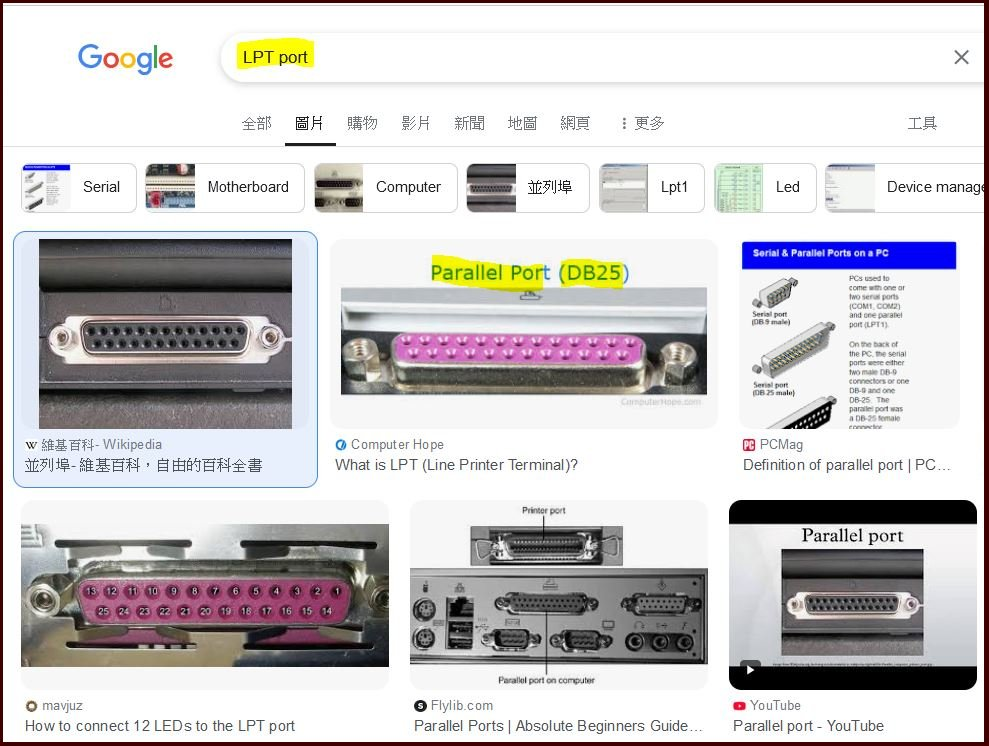

# SEMI-E84-Tester
basic knowledge and testing gauge

### E84 port of Semiconductor factory (FAB) used and LPT port of PC used
the same ISO4902 DB25 plug/socket, both are PARALLEL port  

### power supply & voltage and the port signal
LPT uses +5V, TTL single  
E84 uses +24V +/-6V, 100mA max  
Single ON is active_low, typ 10mA, 1.8V Max  
Single OFF is active_high, typ 200uA, 18V Min  
